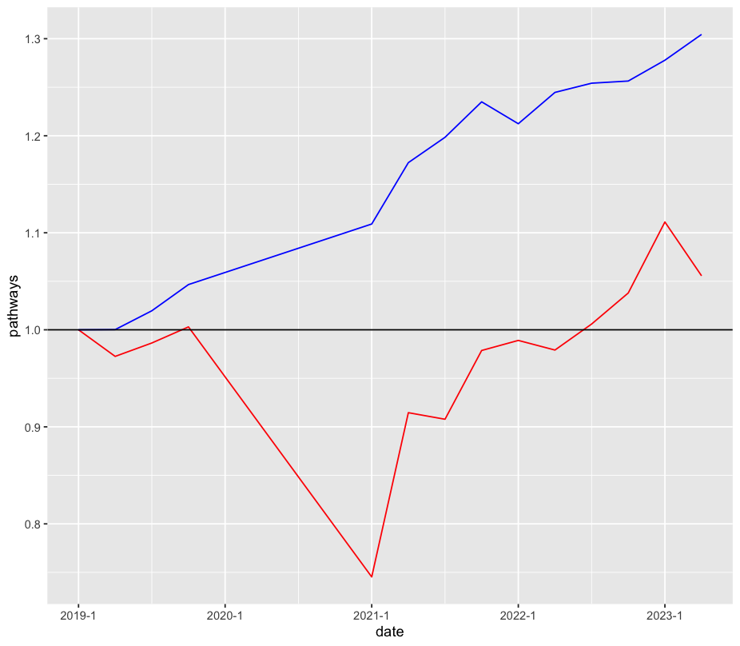

**BACKGROUND**

The elective waitlist has been growing year-on-year for over a decade. With this growth turbocharged in the aftermath of Covid-19, the total waitlist stood at roughly \~8mn by the first quarter of 2024, double its pre-Covid levels. This was followed by an x% increase in average wait times, leading to x% of patients waiting longer than 18 weeks. This is in contravention of the NHS constitution standard established in 2010, which aimed to meet the 18 week target for at least 92% of patients.

The situation has generated substantial political momentum towards a resolution. Pledges were made by major political parties to reduce the waitlist to a more "manageable" size, including most recently by Keir Starmer to [INSERT STARMER PLEDGE HERE].

However, most trusts in 2023/24 are not completing significantly more elective activity than they were in 2019/20, with many completing less. Identifying why trusts are doing less activity and what factors influence a provider's ability to see patients is integral to formulating a coherent policy response.

The first issue of concern is workforce: although much attention has been given to labour shortages, total FTEs have increased year on year to roughly 30% of their 2019Q1 value, whilst the number of completed pathways remains roughly at or slightly above (see below)

{width="349"}

It would be misleading to read this simple causation as saying that workforce does not matter. On the contrary, it is likely there are underlying constraints and bottlenecks that are confounding the results. In order to attempt to disentangle these confounders, this analysis uses a simple linear mixed effects model with a trust-level effect. This allows us to test our variables against the historic completed pathways and dissagregate the impacts to identify why, for example, the increase in FTEs did not ostensibly result in more completed activity.

**MODEL OUTPUTS**

| Metric              | Impact on completed pathways | Change since 2019/20 |
|---------------------|------------------------------|----------------------|
| FTEs                | \+                           | +34%                 |
| Nurses              | \+                           | +24%                 |
| Senior Doctors      | \+                           | +1%                  |
| Managers            | \-                           | -1%                  |
| Operating Theatres  | \+                           | +12%                 |
| Beds                | \+                           | +10%                 |
| Covid-Occupied Beds | \-                           | ---                  |
| Maintenance Backlog | \-                           | +10%                 |
| Post-Covid Shock    | \-                           | ---                  |

: Impact of various metrics versus changes since 2019/20

The model, although simple, identifies three notable trends:

1.  Although more Nurses and Senior Doctors have a positive impact on completed activities, the mix matters. Indeed, the variables were not significant until their interaction (the increase of doctors concurrent with nurses) was taken into account. This suggests that there is a bottleneck that may occur when too many doctors are added without enough nurses and vice-versa, suggesting focus on the composition of workforce may be prudent.
2.  The ratio of serious maintenance backlog to non-serious backlog had a significant negative impact on the number of completed activities. Although capital factors such as more beds and operating theatres have an unsurprisingly positive impact on completed activities, this approach underscores that poorly maintained infrastructure can have a negative impact on a providers' ability deliver more care. The relatively muted growth in capital factors, alongside the apparent growth in the maintenance backlog, suggests they may have acted as limiting factors to the impact of the large and sustained workforce growth.
3.  Finally, we find that there is an unexplained shock post-Covid that has a large negative impact on completed pathways. Even when Covid-occupied beds were taken into account, this factor remains significant, suggesting that the model is not capturing an additional element. It is possible that part of this could be a hidden productivity drop post-Covid, however given the relatively simplicity of the model further research is needed to make that determination conclusively.
